# PMOS — Personal Mobile Operating System

> An AI-powered Personal OS that unifies your tasks, finances, health, memories, and device controls behind a single conversational interface, powered by a multi-agent LangGraph architecture.

---

## Table of Contents

- [Architecture Overview](#architecture-overview)
- [System Components](#system-components)
  - [Backend (Python / FastAPI)](#backend-python--fastapi)
  - [Worker (Go)](#worker-go)
  - [Frontend (React Native / Expo)](#frontend-react-native--expo)
  - [Website (Next.js)](#website-nextjs)
- [AI Agent Architecture](#ai-agent-architecture)
  - [The Brain — Gemini 2.5 Flash](#1-the-brain--gemini-25-flash)
  - [The Hands — Kimi K2](#2-the-hands--kimi-k2)
  - [The Researcher — Groq Compound](#3-the-researcher--groq-compound)
  - [LangGraph Flow](#langgraph-flow)
  - [Tool Retrieval (FAISS + Voyage AI)](#tool-retrieval-faiss--voyage-ai)
- [LLM Processing Chains](#llm-processing-chains)
- [Database Schema](#database-schema)
- [Infrastructure & DevOps](#infrastructure--devops)
- [Getting Started](#getting-started)
- [Environment Variables](#environment-variables)

---

## Architecture Overview

```
┌─────────────────────────────────────────────────────────────────┐
│                        PMOS Architecture                        │
├─────────────────────────────────────────────────────────────────┤
│                                                                 │
│   ┌──────────────┐    SSE/REST     ┌──────────────────────┐    │
│   │   Frontend    │◄──────────────►│     Backend (API)     │    │
│   │  React Native │                │  FastAPI + LangGraph  │    │
│   │   (Expo 54)   │                │                      │    │
│   └──────────────┘                 └──────────┬───────────┘    │
│                                                │                │
│                          ┌─────────────────────┼─────────┐     │
│                          │                     │         │     │
│                    ┌─────▼─────┐   ┌──────────▼──┐  ┌───▼───┐ │
│                    │ PostgreSQL │   │    Redis     │  │ChromaDB│ │
│                    │  (Prisma)  │   │  (Queue +    │  │(Vector │ │
│                    │  14 Models │   │   Cache)     │  │ Store) │ │
│                    └───────────┘   └──────┬──────┘  └───────┘  │
│                                           │                     │
│                                    ┌──────▼──────┐             │
│                                    │   Worker     │             │
│                                    │   (Go)       │             │
│                                    │  FCM Push    │             │
│                                    └─────────────┘             │
│                                                                 │
│   ┌──────────────┐                                             │
│   │   Website     │   Next.js Marketing / Landing Page         │
│   └──────────────┘                                             │
└─────────────────────────────────────────────────────────────────┘
```

---

## System Components

### Backend (Python / FastAPI)

**Location:** `backend/`

The core API server built with **FastAPI**, serving 13 route modules that cover every domain of the Personal OS.

| Router      | Prefix              | Purpose                                                        |
| ----------- | ------------------- | -------------------------------------------------------------- |
| `auth`      | `/auth`             | Firebase Authentication (Google Sign-In), session management   |
| `github`    | `/auth/github`      | GitHub OAuth integration for developer stats                   |
| `slack`     | `/auth/slack`       | Slack OAuth integration                                        |
| `query`     | `/query`            | Main AI conversation endpoint (text, voice, streaming via SSE) |
| `memory`    | `/memory`           | CRUD for user memories (with ChromaDB vector search)           |
| `tasks`     | `/tasks`            | Task sections & to-do items with notification scheduling       |
| `finance`   | `/finance`          | Transactions, pending transactions, SMS auto-parsing           |
| `accounts`  | `/finance/accounts` | Bank account management                                        |
| `content`   | `/content`          | Content watchlist (movies, books, social media links)          |
| `focus`     | `/focus`            | Focus/deep-work session tracking                               |
| `nutrition` | `/nutrition`        | Daily calorie logs, meal tracking, food image analysis         |
| `health`    | `/health`           | Goals system, period cycle tracking, health dashboard          |
| `journal`   | `/journal`          | Daily journaling (Personal & Dev types)                        |
| `dev`       | `/dev`              | Developer dashboard (GitHub stats, dev journal)                |

**Startup Lifecycle** (`core/lifespan.py`):

1. Connect to **PostgreSQL** via Prisma ORM
2. Connect to **Redis** (async)
3. Connect to **ChromaDB** (vector store)
4. Initialize **Firebase Admin SDK**

**Key Services** (`services/`):

| Service                | File               | Description                                                        |
| ---------------------- | ------------------ | ------------------------------------------------------------------ |
| Notification Scheduler | `notify.py`        | Schedules delayed push notifications via Redis sorted sets         |
| Tool Registry          | `tool_registry.py` | FAISS vector index of all tools, queried with Voyage AI embeddings |
| Voice Transcription    | `transcribe.py`    | Audio-to-text using Groq Whisper Large V3                          |

---

### Worker (Go)

**Location:** `worker/`

A lightweight Go service that acts as a **background notification processor**. It continuously polls a Redis sorted set for due notifications and dispatches them via **Firebase Cloud Messaging (FCM)**.

**How it works:**

```
┌──────────────────────────────────────────────────┐
│                Notification Pipeline              │
│                                                    │
│   Backend                    Redis                 │
│   ┌──────────┐    ZADD     ┌─────────────┐        │
│   │ Schedule  │───────────►│ ZSET         │        │
│   │ Notify()  │            │ notification │        │
│   └──────────┘    SET      │ _queue       │        │
│                ───────────►│              │        │
│                            │ notification:│        │
│                            │ data:{id}    │        │
│                            └──────┬──────┘        │
│                                   │                │
│   Worker (Go)                     │ ZRANGEBYSCORE  │
│   ┌──────────────┐    Poll (1s)   │ (now)          │
│   │ processJobs()│◄──────────────┘                │
│   │              │                                 │
│   │  ┌─────────┐ │     FCM Multicast              │
│   │  │sendToFCM│─┼────────────────► User Devices  │
│   │  └─────────┘ │                                 │
│   └──────────────┘                                 │
└──────────────────────────────────────────────────┘
```

**Flow:**

1. Backend calls `schedule_notification()` → writes payload to Redis hash + adds job ID to a sorted set with the scheduled timestamp as score
2. Worker polls every **1 second** using `ZRANGEBYSCORE` for jobs where score ≤ `now()`
3. Atomically removes the job (`ZREM`) to prevent duplicate processing
4. Fetches the payload JSON from the Redis hash
5. Sends via FCM's `SendEachForMulticast` to all registered device tokens
6. Cleans up the hash key

**Config:** `REDIS_HOST`, `REDIS_PORT`, `serviceAccountKey.json`
**Batch Size:** 10 jobs per poll cycle

---

### Frontend (React Native / Expo)

**Location:** `frontend/`

A **React Native** mobile app built with **Expo SDK 54** and **expo-router** for file-based navigation. Targets **Android** primarily, with iOS support structures in place.

#### Tab Screens

| Tab       | File             | Description                                           |
| --------- | ---------------- | ----------------------------------------------------- |
| Home      | `home.tsx`       | Dashboard with AI assistant, quick actions            |
| Tasks     | `tasks.tsx`      | Kanban-style task management with sections            |
| Finance   | `finance.tsx`    | Expense tracking, pending transactions, bank accounts |
| Health    | `health.tsx`     | Goals, period tracking, health stats                  |
| Nutrition | `nutrition.tsx`  | Calorie tracking with food image analysis             |
| Memory    | `memory.tsx`     | Searchable memories with vector search                |
| Content   | `content.tsx`    | Watchlist for movies, books, social media             |
| Journal   | `journal.tsx`    | Daily journaling                                      |
| Focus     | `restrictor.tsx` | Deep work timer with app blocking                     |
| Dev       | `dev.tsx`        | Developer dashboard with GitHub integration           |
| Explore   | `explore.tsx`    | Discovery & exploration features                      |
| Config    | `config.tsx`     | App settings                                          |

#### AI Assistant (`AssistantOverlay.tsx`)

The conversational UI that communicates with the backend:

- **Text input** → REST POST to `/query`
- **Voice input** → Records audio → uploads to backend → Groq Whisper transcription → processes query
- **SSE streaming** → Real-time streamed responses from the AI agent
- **Client-side tool execution** → When the AI returns a `tool_call` for client tools (e.g., `open_app`, `set_alarm`), the frontend executes them natively

#### Native Android Modules (`utils/`)

| Module               | Purpose                                    |
| -------------------- | ------------------------------------------ |
| `AlarmManager.ts`    | Set native Android alarms                  |
| `AppLauncher.ts`     | Open apps by package name                  |
| `ContactManager.ts`  | Look up and call contacts                  |
| `MediaManager.ts`    | Play/pause/skip music                      |
| `SleepManager.ts`    | Track sleep sessions                       |
| `SmsManager.ts`      | Send SMS silently                          |
| `WhatsAppManager.ts` | Open WhatsApp with pre-filled messages     |
| `IntentHandler.ts`   | Central dispatcher for all AI tool calls   |
| `FCMManager.ts`      | Firebase Cloud Messaging token management  |
| `HealthManager.ts`   | Android Health Connect integration         |
| `SystemManager.ts`   | Device system controls (brightness, torch) |

#### Background Services

- `BackgroundService.ts` — Runs persistent background tasks
- `BlockerService.ts` — App blocking during focus sessions

#### SMS Auto-Parsing (`smsParser.ts`)

Intercepts incoming bank transaction SMS → sends to backend's `sms_parser` chain → auto-creates pending transactions.

---

### Website (Next.js)

**Location:** `website/`

A marketing/landing page built with **Next.js** and **TailwindCSS**. Contains component-based sections for showcasing the app features.

---

## AI Agent Architecture

The AI system uses a **multi-agent architecture** built with **LangGraph**, where each agent is a specialized LLM with a distinct role. This separation ensures reasoning quality, tool-calling accuracy, and web search capabilities are each optimized independently.

### 1. The Brain — Gemini 2.5 Flash

**Model:** `gemini-2.5-flash` (Google)
**Role:** Reasoning, intent classification, and natural conversation.
**Temperature:** 0.3

The Brain does **NOT** have tools bound to it. Instead, it understands the user's intent and outputs structured delegation commands:

- `||DELEGATE||: <SYSTEM> - <instruction>` → Routes to the action mapper
- `||SEARCH||: <query>` → Routes to the web search agent
- Plain text → Returns directly as conversational response

It has awareness of 6 subsystems: Memory & Search, Productivity, Health & Biology, Finance & Assets, Device & Communications, and Lifestyle & Growth.

### 2. The Hands — Kimi K2

**Model:** `moonshotai/kimi-k2-instruct-0905` (via Groq)
**Role:** Precise tool selection and argument generation.
**Temperature:** 0.0

Receives the Brain's delegation instruction and:

1. Expands the instruction with domain-specific keywords
2. Queries the FAISS tool index for the top-K relevant tools
3. Binds the retrieved tools and generates exact tool calls with arguments

**Safety injections** ensure critical companion tools are always available (e.g., `create_section` is injected alongside `create_task`).

### 3. The Researcher — Groq Compound

**Model:** `groq/compound` (via Groq)
**Role:** Web search and factual answers.
**Temperature:** 0.0

Handles `||SEARCH||` requests with concise, linked answers.

### LangGraph Flow

```mermaid
graph TD
    START([User Query]) --> brain[🧠 Brain Node<br/>Gemini 2.5 Flash]

    brain -->|"||DELEGATE||"| map_action[🤖 Action Mapper<br/>Kimi K2]
    brain -->|"||SEARCH||"| search[🌍 Search Node<br/>Groq Compound]
    brain -->|Conversation| END([Response])

    map_action -->|Server Tool| execute_server[⚙️ Tool Execution<br/>LangGraph ToolNode]
    map_action -->|Client Tool| END
    map_action -->|Search Fallback| search

    execute_server -->|Result| brain
    search --> END
```



**Key Routing Logic:**

- After the Brain speaks → `router_brain()` checks for `||DELEGATE||` or `||SEARCH||` markers
- After Kimi selects tools → `router_action()` determines if tools are server-side (execute immediately) or client-side (return to frontend)
- After server tools execute → results flow back to the Brain for a final confirmation response

### Tool Retrieval (FAISS + Voyage AI)

Instead of binding all 40+ tools to every LLM call, PMOS uses **semantic tool retrieval**:

1. At startup, all tool descriptions are embedded using **Voyage AI** (`voyage-3` model)
2. Embeddings are stored in a **FAISS** vector index
3. At query time, the action mapper searches the index for the top-K most relevant tools
4. Only the retrieved tools are bound to Kimi for that specific invocation

This keeps LLM context windows small and improves tool selection accuracy.

#### Tool Categories

| Category               | Examples                                                                                                                                         | Execution                   |
| ---------------------- | ------------------------------------------------------------------------------------------------------------------------------------------------ | --------------------------- |
| **Client Tools** (10)  | `call_contact`, `open_app`, `set_alarm`, `set_timer`, `play_media`, `send_whatsapp`, `send_sms`, `sleep_tracking`, `schedule_critical_memory`    | On the phone (React Native) |
| **Server Tools** (30+) | `create_task`, `save_memory`, `search_memory`, `add_transaction`, `log_meal`, `log_water`, `log_period`, `save_journal`, `get_dev_profile`, etc. | On the backend (ToolNode)   |

---

## LLM Processing Chains

Independent LLM chains handle specialized preprocessing tasks. All use **Groq's Llama 3.3 70B**.

| Chain             | File                      | Input                                      | Output                        | Purpose                                                                                                                  |
| ----------------- | ------------------------- | ------------------------------------------ | ----------------------------- | ------------------------------------------------------------------------------------------------------------------------ |
| **Enricher**      | `chains/enricher.py`      | Raw user query + last 3 conversation turns | Refined query string          | Resolves pronouns ("it", "that"), disambiguates commands vs. searches, and infers dates/times                            |
| **Summarizer**    | `chains/summarizer.py`    | User query + AI response                   | Extracted facts or `NO_FACTS` | Runs in background after each conversation; extracts meaningful facts and saves them to ChromaDB for long-term memory    |
| **SMS Parser**    | `chains/sms_parser.py`    | Bank SMS text + user's accounts            | Structured transaction data   | Parses transaction SMS into structured data (amount, type, merchant, category, account) using Pydantic structured output |
| **Food Analyzer** | `chains/food_analyzer.py` | Base64 food image                          | `{name, kcal}`                | Uses Llama 4 Scout vision model to identify food and estimate calories from photos                                       |

---

## Database Schema

**ORM:** Prisma Client Python (async)
**Database:** PostgreSQL 16

```
User
 ├── ConversationLog      # Chat history with enricher metadata
 ├── CoreMemory           # AI-extracted facts with certainty scores
 ├── Memory               # User memories with tags, reminders
 ├── TaskSection           # Task groups (Work, Personal, etc.)
 │    └── Task             # Individual tasks with due dates
 ├── BankAccount           # Linked bank accounts
 │    └── Transaction      # Financial transactions
 ├── PendingTransaction    # Unconfirmed transactions (from SMS)
 ├── ContentItem           # Watchlist (movies, books, social)
 ├── FocusSession          # Deep work session history
 ├── DailyLog              # Daily nutrition tracking
 │    └── MealItem         # Individual meals with calories
 ├── Goal                  # Health & habit goals
 │    └── GoalLog          # Daily progress logs
 ├── PeriodCycle           # Menstrual cycle tracking
 └── DailyJournal          # Daily journal entries (Personal/Dev)
```

**Vector Store (ChromaDB):** Stores conversation summaries and core memories as embeddings for semantic search ("recall everything").

---

## Infrastructure & DevOps

### Docker Compose (Local Development)

**File:** `docker-compose.yml`

| Service   | Image                    | Port      | Purpose                                                |
| --------- | ------------------------ | --------- | ------------------------------------------------------ |
| `db`      | `postgres:16`            | 5432      | Primary database                                       |
| `redis`   | `redis:alpine`           | 6379      | Queue + cache (password protected, 256MB, allkeys-lru) |
| `chroma`  | `chromadb/chroma:latest` | 8001→8000 | Vector database                                        |
| `backend` | Built from `./backend`   | 8000      | FastAPI API server                                     |
| `worker`  | Built from `./worker`    | —         | Notification processor                                 |

All services share an `app-network` bridge. Health checks ensure startup order: `db` (healthy) → `redis` (healthy) → `chroma` (started) → `backend` → `worker`.

### Docker Compose (Production)

**File:** `docker-compose.prod.yml`

Production adds:

- **Traefik** reverse proxy integration via labels (`backend.pmos.rishik.codes`)
- Automatic TLS certificates via `certresolver`
- Pre-built images from Docker Hub (`rishik92/pmos-backend:latest`, `rishik92/pmos-worker:latest`)
- Separate `.env.backend` and `.env.worker` files
- External `nativex-net` network for Traefik routing

### CI/CD (GitHub Actions)

**File:** `.github/workflows/deploy.yaml`

Triggered on `push` to `main` when `backend/`, `worker/`, `docker-compose.prod.yml`, or workflows change:

```
Push to main
    │
    ▼
┌──────────────┐     ┌──────────────┐
│  Build Job    │     │  Deploy Job  │
│               │     │  (needs:     │
│ • Docker Hub  │────►│   build)     │
│   Login       │     │              │
│ • Build &     │     │ • SCP compose│
│   Push Images │     │   to droplet │
│               │     │ • SSH pull + │
│               │     │   up -d      │
└──────────────┘     └──────────────┘
```

**Target:** DigitalOcean Droplet via SSH

### Backend Dockerfile

Multi-step build:

1. Base: `python:3.12-slim`
2. Install `uv` + `requirements.txt`
3. Install `libatomic1` (required by some native deps)
4. Generate Prisma client
5. Entry: `entrypoint.sh` → runs `prisma migrate deploy` → starts `uvicorn`

### Worker Dockerfile

Multi-stage build:

1. **Builder stage:** `golang:1.24-alpine` — compiles a statically linked binary
2. **Runtime stage:** `alpine:latest` — minimal image with just the binary

---

## Getting Started

### Prerequisites

- Docker & Docker Compose
- Node.js 18+ (for frontend development)
- Android Studio / SDK (for mobile app)

### 1. Clone & Configure

```bash
git clone <repo-url> pmos
cd pmos
```

Create environment files:

- `backend/.env` — API keys and secrets
- `worker/.env` — Worker-specific config

### 2. Start Infrastructure

```bash
docker compose up -d
```

This starts PostgreSQL, Redis, ChromaDB, the backend API, and the worker.

### 3. Run Frontend (Development)

```bash
cd frontend
npm install
npx expo run:android
```

---

## Environment Variables

### Backend (`backend/.env`)

| Variable               | Description                                |
| ---------------------- | ------------------------------------------ |
| `DATABASE_URL`         | PostgreSQL connection string               |
| `REDIS_HOST`           | Redis hostname (default: `localhost`)      |
| `REDIS_PORT`           | Redis port (default: `6379`)               |
| `CHROMA_HOST`          | ChromaDB hostname (default: `localhost`)   |
| `CHROMA_PORT`          | ChromaDB port (default: `8001`)            |
| `GOOGLE_API_KEY`       | Google Gemini API key                      |
| `GROQ_API_KEY`         | Groq API key (Kimi K2, Llama 3.3, Whisper) |
| `VOYAGE_API_KEY`       | Voyage AI API key (tool embeddings)        |
| `FIREBASE_CREDENTIALS` | Path to Firebase service account JSON      |

### Worker (`worker/.env`)

| Variable                         | Description                           |
| -------------------------------- | ------------------------------------- |
| `REDIS_HOST`                     | Redis hostname                        |
| `REDIS_PORT`                     | Redis port                            |
| `GOOGLE_APPLICATION_CREDENTIALS` | Path to Firebase service account JSON |

---

## Tech Stack Summary

| Layer                  | Technology                                                             |
| ---------------------- | ---------------------------------------------------------------------- |
| **Mobile App**         | React Native 0.81, Expo 54, TypeScript                                 |
| **Backend API**        | Python 3.12, FastAPI, Uvicorn                                          |
| **AI Framework**       | LangGraph, LangChain                                                   |
| **LLMs**               | Gemini 2.5 Flash, Kimi K2, Llama 3.3 70B, Llama 4 Scout, Groq Compound |
| **Embeddings**         | Voyage AI (voyage-3)                                                   |
| **Vector Search**      | FAISS (tool retrieval), ChromaDB (memory)                              |
| **Database**           | PostgreSQL 16 + Prisma ORM                                             |
| **Cache/Queue**        | Redis (sorted sets for delayed jobs)                                   |
| **Worker**             | Go 1.24                                                                |
| **Push Notifications** | Firebase Cloud Messaging                                               |
| **Auth**               | Firebase Auth (Google Sign-In)                                         |
| **Voice**              | Groq Whisper Large V3                                                  |
| **Website**            | Next.js + TailwindCSS                                                  |
| **Infrastructure**     | Docker, Docker Compose, Traefik                                        |
| **CI/CD**              | GitHub Actions → DigitalOcean                                          |
